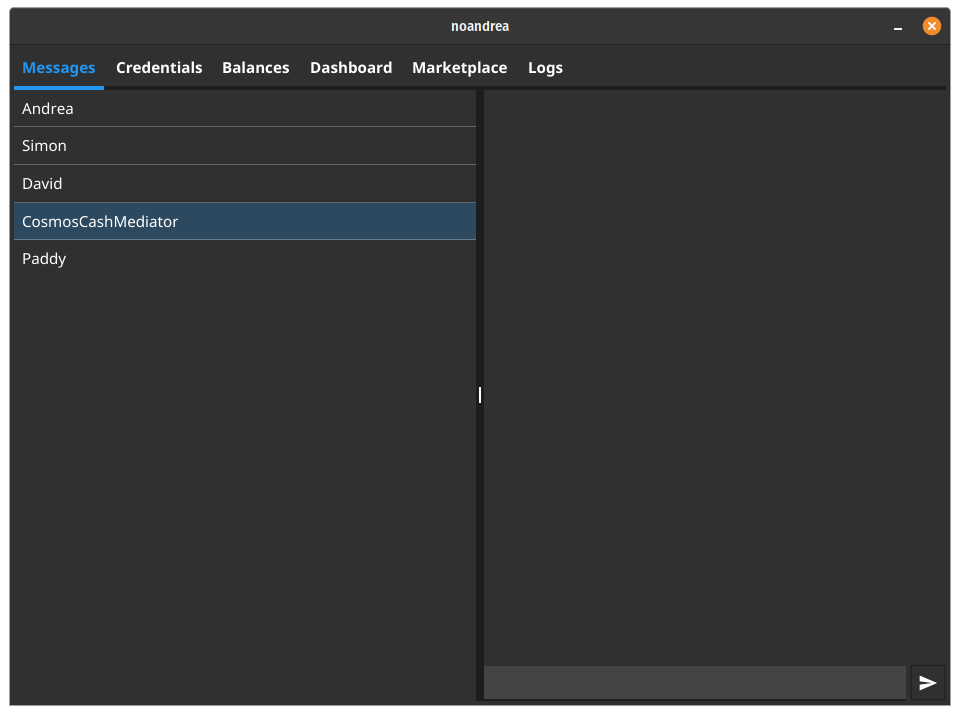

## Cosmos Cash Agent

This project implements a demo interface for the [Cosmos Cash](https://github.com/allinbits/cosmos-cash) project to showcase the interactions from the user perspective.


## Architecture

> Note: The project has been developed as a proof of concept!

The entrypoint for the desktop client is `cmd/edge-agent/main.go`

The project is composed of the following components:

- User interface: ([`pkg/ui`](https://github.com/allinbits/cosmos-cash-agent/tree/main/pkg/ui))
- Token wallet ([`pkg/wallets/chain`](https://github.com/allinbits/cosmos-cash-agent/tree/main/pkg/wallets/chain))
- SSI Wallet ([`pkg/wallets/ssi`](https://github.com/allinbits/cosmos-cash-agent/tree/main/pkg/wallets/ssi))

The components run in their own isolated event loop, events for each component are dispatched via channels.

The messages are implemented as `AppMsg` struct that is:

```golang
// AppMsg are messages that are exchanged within the app
type AppMsg struct {
    Typ     int         // message type (see list above)
    Payload interface{} // content of the message, the recipient must know how to process it
}
```

Messages related code is defined [here](https://github.com/allinbits/cosmos-cash-agent/blob/main/pkg/config/messages.go).

### Component logic 

Most of the logic is concentrated in the following source files:
- User interface: [`pkg/ui/handlers.go`](https://github.com/allinbits/cosmos-cash-agent/blob/main/pkg/ui/handlers.go)
- Token wallet: [`pkg/wallets/chain/chain.go`](https://github.com/allinbits/cosmos-cash-agent/blob/main/pkg/wallets/chain/chain.go)
- SSI wallet: [`pkg/wallets/ssi/aries.go`](https://github.com/allinbits/cosmos-cash-agent/blob/main/pkg/wallets/ssi/aries.go)


### Setup 

The ui is built using [fyne](https://fyne.io/) framework. 

> Note: make sure that you have the [prerequisites](https://developer.fyne.io/started/#prerequisites) installed before running 

To run the app targeting the Cosmos Cash testnet, run 

```sh
make run-live
```

## Screenshots



<!--
## See it in action 

The following video shows a demo interaction between two actors

[](https://www.youtube.com/watch?v=YGikLx6ow0k)

-->

